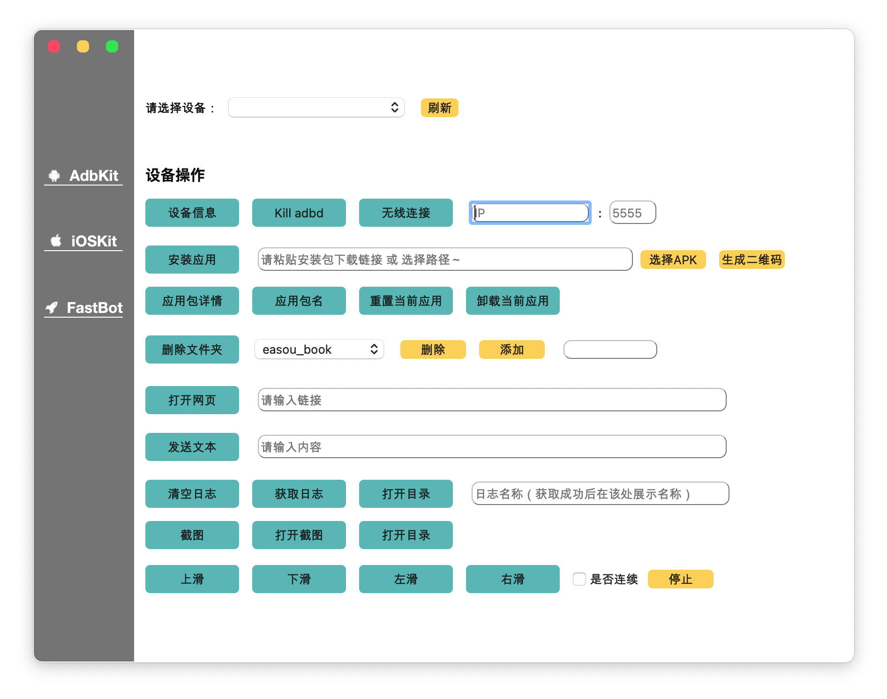

> 原项目：[abeelan/mobileTestToolkit](https://github.com/abeelan/mobileTestToolkit)

# 项目说明

使用 PyQt5 打造测试工具 GUI 页面。
- adbuitls：https://github.com/openatx/adbutils 
- tidevice：https://github.com/alibaba/taobao-iphone-device
- fastbot-android：https://github.com/bytedance/Fastbot_Android 
- fastbot-ios：https://github.com/bytedance/Fastbot_iOS



# 安装
```shell
# 工具类
$ pip install -r requirements.txt
$ pip install pyinstaller  # 打包
```

# 打包

1. 使用 pyinstaller 打包，在程序入口下，对 main.py 进行打包

```shell
$ pyinstaller -F -w main.py
```

- -F：产生单个可执行文件
- -w：取消运行时展示命令行黑框
- -d：debug模式

注意： 图片必须使用绝对路径，否则打包不展示

打包成功后，会生成下面三个文件
```shell
build/
dist/
main.spec
```
可以将项目中的其他文件(比如图片、.sql数据库文件、yaml配置文件等等)，按原来的目录结构复制到dist文件夹中(Mac可能在dist文件夹下有一个以filename命名的文件夹，所有信息在filename文件夹中)，如果有缺少文件会导致项目打不开

2. 生成spec文件打包
```shell
$ pyi-makespec -Fw main.py
# 编辑main.spec文件a字段中hiddenimports=['config', 'gui', 'utils']
$ pyinstaller main.spec
```

# 问题记录


### Q：为什么 super().__init() 括号会标黄？
A：不是 PyQt 的问题，程序不会出错，是 Pycharm 的提示问题。

在上方添加 ```# noinspection PyArgumentList``` 这句注释即可去掉。没强迫症的话就不用管啦。

Q：为什么绑定事件时，connect 会被标黄？
A：不是 PyQt 的问题，程序不会出错，是 Pycharm 的提示问题。

解决：```alt + enter``` 快捷键，在弹框内选择忽略即可，没强迫症的话就不用管啦。

Q：按钮事件如何绑定？
A：此处有两种绑定方法，需要注意区分使用：
- 绑定的事件不需要传参，写法如下：
```
self.left_button_1.clicked.connect(self.open_first_window)
```
提醒一下：自动补全 ```self.open_first_window``` 方法时，后面是带()的，需要去掉。

不然会报错：```TypeError: argument 1 has unexpected type 'tuple'```，去掉括号即可。

不想去掉括号，使用 ```lambda```表达式也可以，如下。

- 绑定的事件需要传参，写法如下：

```
self.website_button_1.clicked.connect(lambda: self.__func.open_url(self.__url_cfg.ZENTAO))
```
这里我调用了一个```open_url(url)```的方法，它需要一个```url```的传参才可以正常运行，此时，就需要用到```lambda```表达式。我们使用 lambda 传递按钮数字给槽，也可以传递任何其他东西---甚至是按钮组件本身。

什么是 ```lambda``` 表达式？

lambda的一般形式是关键字lambda后面跟一个或多个参数，紧跟一个冒号，以后是一个表达式。lambda是一个表达式而不是一个语句。它能够出现在Python语法不允许def出现的地方。作为表达式，lambda返回一个值（即一个新的函数）。lambda用来编写简单的函数，而def用来处理更强大的任务。
